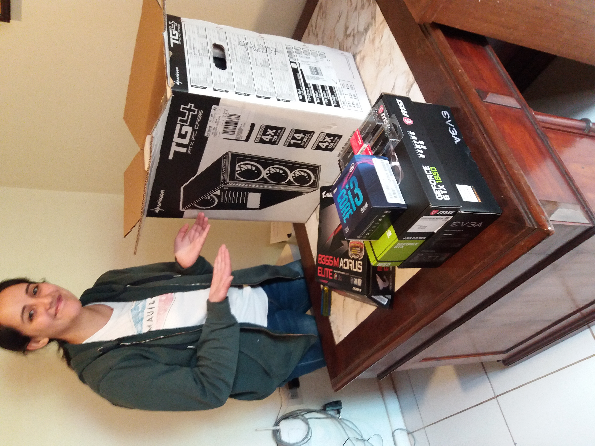
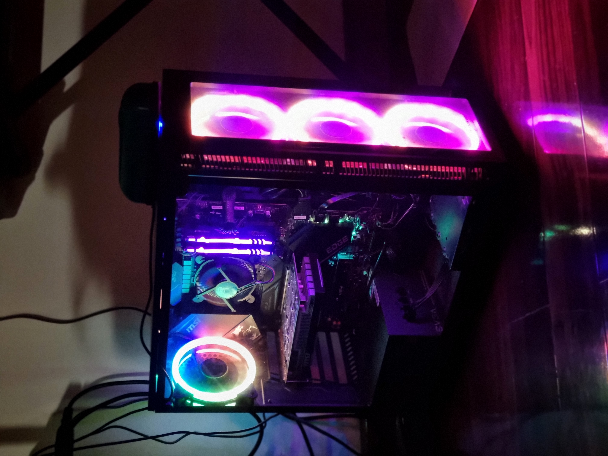
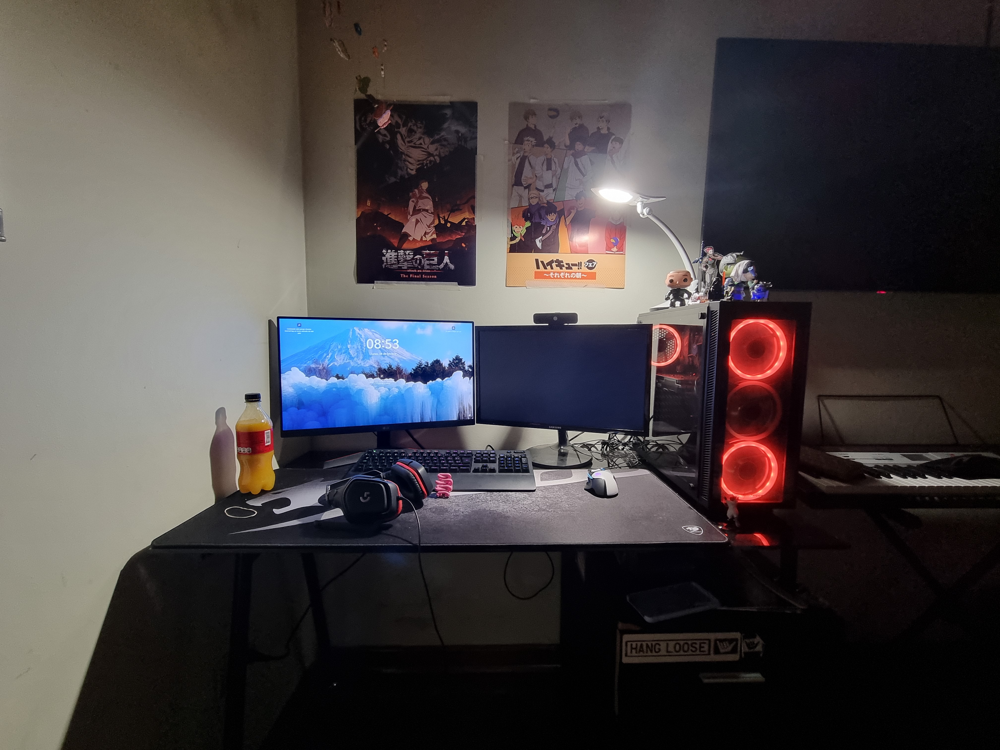

# 🖥️ Custom PC Build – Intel i3-9100F

---

## 📌 Overview
Custom-built desktop computer designed for general use and light gaming.  
This project demonstrates hands-on experience in PC assembly, hardware compatibility, system configuration, and troubleshooting.

---

## ⚙️ Hardware Specifications

| Component | Model |
|----------|------|
| CPU | Intel Core i3-9100F |
| Motherboard | Gigabyte B365M AORUS Elite |
| RAM | 8GB (2x4GB) HyperX Fury 2666MHz |
| Storage | 1TB Western Digital Blue HDD |
| GPU | MSI GTX 1650 Ventus XS OC 4GB |
| PSU | EVGA 600W 80+ Bronze |
| Case | Sharkoon TG4 |

---

## 🔧 Build Process

- Installed CPU and cooler  
- Configured RAM in dual-channel  
- Mounted motherboard into case  
- Installed PSU and routed cables  
- Installed GPU  
- Performed cable management  
- Completed initial boot and BIOS configuration  

---

## 💻 System Configuration

- Operating system installation  
- Driver installation  
- System updates and basic configuration  

---

## 🧪 Testing & Validation

- ✅ Successful POST (Power-On Self Test)  
- ✅ All components recognized correctly  
- ✅ Stable performance under normal usage  

---

## 📷 Build Transformation

Comparison between the initial state and the final assembled system.

### Before

  

### After

  
  

---

## 🛠️ Skills Demonstrated

- PC assembly  
- Hardware compatibility analysis  
- Troubleshooting  
- OS installation  
- Cable management  

---

## 🚀 Future Improvements

- Upgrade to SSD for faster performance  
- Increase RAM capacity  
- Improve airflow and cooling  

---

## 📎 Summary

Performed full system assembly, hardware installation, and configuration of a desktop computer, ensuring system stability and proper component integration.
